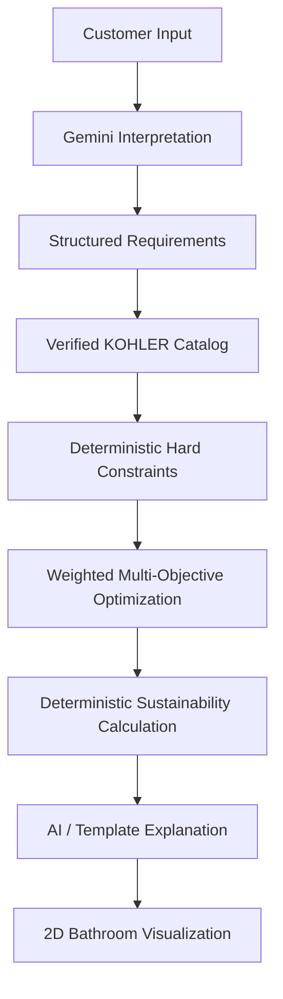

# KOHLER AI Bathroom Designer & Planner

> AI-assisted bathroom planning that turns customer constraints into explainable, space-aware KOHLER product bundles.

**Live demo:** https://kohler-ai-bathroom-designer-alpha.vercel.app/

## Overview

KOHLER AI Bathroom Designer & Planner is a full-stack Next.js application that helps customers design a bathroom around:

- Bathroom dimensions
- Optional bathroom image
- Budget
- Aesthetic preference
- Household size
- Required bathroom fixture categories

The system combines **multimodal AI for understanding** with **deterministic TypeScript logic for decision-making**.

> **AI understands the customer. Verified product data and deterministic optimization make the recommendation.**

The application does not ask an LLM to invent product facts or decide which products fit. AI extracts structured requirements and provides natural-language interpretation, while deterministic logic performs product filtering, constraint validation, scoring, sustainability calculations, and layout generation.

## Key Features

### AI requirement understanding

Users can describe their bathroom in natural language. Gemini converts the request into structured requirements that the user can review and edit.

### Bathroom image analysis

Users can upload a bathroom photograph.

The AI can extract:

- Room shape
- Existing fixtures
- Style cues
- Layout cues
- Door/window cues
- Explicitly visible dimensions

The application deliberately avoids inventing room measurements that are not visible in the image.

### Deterministic product optimization

Recommendations are generated using verified catalog data and deterministic rules.

The engine considers:

- Hard budget constraint
- Required category coverage
- Physical zone fit
- Style match
- Sustainability
- Value
- Space fit
- Collection coherence
- Other weighted scoring factors defined by the optimization engine

### KOHLER product bundles

The application recommends bundles across:

- Toilets
- Faucets
- Showers
- Vanities

The catalog also includes explicit support for smart/intelligent toilets and thermostatic shower-system components.

Product records contain structured data such as model number, INR price, dimensions, installation information, water consumption where available, style metadata, data confidence, verification date, and KOHLER product URL.

### Sustainability estimates

The system calculates estimated annual water use and savings using transparent assumptions.

Water consumption is represented in liters:

- Toilets: liters per flush (LPF)
- Faucets: liters per minute (LPM)
- Showers: liters per minute (LPM)

Results are explicitly presented as **estimates**, not guaranteed real-world savings.

### 2D bathroom visualization

The application generates a zone-based 2D bathroom plan showing room dimensions, fixture zones, product footprints where appropriate, fixture labels, dimension annotations, and thermostatic-system markers.

The visualization is intentionally presented as a **feasibility visualization**, not certified CAD, architectural, plumbing, or building-code documentation.

### Explainable recommendations

The result screen exposes:

- Total estimated bundle cost
- Budget utilization
- Overall recommendation score
- Product-level details
- Estimated annual water impact
- Explanation of why the top bundle was selected

## Core Architecture



### AI vs. deterministic responsibilities

| Responsibility | AI | Deterministic logic |
|---|:---:|:---:|
| Understand natural-language requirements | ✓ | |
| Interpret bathroom image | ✓ | |
| Generate natural-language explanation | ✓ | |
| Product facts | | ✓ |
| Budget validation | | ✓ |
| Product/zone fit | | ✓ |
| Product scoring | | ✓ |
| Bundle ranking | | ✓ |
| Sustainability calculation | | ✓ |
| 2D placement | | ✓ |

### Critical trust boundary

The LLM must not invent critical product information such as:

- Price
- Dimensions
- Water consumption
- Compatibility
- Installation requirements
- Electrical requirements

Those facts come from the curated product catalog.

## Technology Stack

### Frontend

- Next.js 15
- React
- TypeScript
- Tailwind CSS
- shadcn/ui
- react-konva
- Zustand

### AI

- Google Gemini API
- Structured JSON output for requirement interpretation
- Multimodal image understanding
- Template-based explanation fallback

### Validation & logic

- Zod
- Deterministic TypeScript constraint engine
- Weighted bundle scoring
- Deterministic sustainability calculator
- Zone-based spatial model

### Deployment

- Vercel
- GitHub

## Project Structure

```text
kohler-ai-bathroom-designer/
├── app/
│   ├── api/
│   │   ├── analyze-image/route.ts
│   │   ├── interpret/route.ts
│   │   └── recommend/route.ts
│   ├── globals.css
│   └── page.tsx
├── components/
│   ├── bathroom-layout.tsx
│   └── ui/
├── data/
│   ├── categories.ts
│   ├── products.ts
│   ├── products.backup.ts
│   ├── schemas.ts
│   ├── styles.ts
│   └── sustainability-baselines.ts
├── lib/
│   ├── ai/
│   │   ├── fallback.ts
│   │   └── gemini.ts
│   ├── engine/
│   │   ├── constraints.ts
│   │   ├── optimizer.ts
│   │   ├── scoring.ts
│   │   └── sustainability.ts
│   ├── layout/
│   │   ├── generate-layout.ts
│   │   └── templates.ts
│   └── utils.ts
├── public/
│   └── images/
│       └── marble-bg.svg
├── types/
│   ├── product.ts
│   └── recommendation.ts
├── __tests__/
│   ├── constraints.test.ts
│   ├── optimizer.test.ts
│   ├── scoring.test.ts
│   └── sustainability.test.ts
├── .gitignore
├── next.config.ts
├── package.json
└── README.md
```

## Getting Started

### Prerequisites

- Node.js 20+ recommended
- npm
- A Google Gemini API key

### 1. Clone the repository

```bash
git clone https://github.com/DivyanshAgarwal7/kohler-ai-bathroom-designer.git
cd kohler-ai-bathroom-designer
```

### 2. Install dependencies

```bash
npm install
```

### 3. Configure the Gemini API key

Create `.env.local`:

```env
GEMINI_API_KEY=your_gemini_api_key
```

Never commit `.env.local`. The repository ignores `.env*`.

### 4. Start development

```bash
npm run dev
```

Open `http://localhost:3000`.

## Available Scripts

```bash
npm run dev
npm run lint
npm test
npm run build
npm run start
```

## API Routes

### `POST /api/interpret`

Parses natural-language bathroom requirements into structured data.

### `POST /api/analyze-image`

Analyzes an uploaded bathroom image and returns structured visual cues.

### `POST /api/recommend`

Validates requirements, generates feasible product bundles, calculates sustainability metrics, and generates a zone-based layout.

The API routes execute on the server and the Gemini API key is not exposed to the client.

## Recommendation Pipeline

1. **Requirement interpretation** — Free text and optional image input become structured requirements.
2. **Catalog validation** — Product records are validated using Zod.
3. **Hard constraints** — Infeasible combinations are removed using rules such as `total cost <= budget`, required category coverage, and zone fit.
4. **Multi-objective scoring** — Feasible bundles are scored using deterministic objectives such as style, sustainability, value, space fit, and coherence.
5. **Sustainability calculation** — Annual water use and savings are estimated from verified water-use data and stated assumptions.
6. **Explanation** — Natural-language explanation is generated from facts already produced by the deterministic engine, with a template fallback.
7. **Visualization** — The selected bundle becomes a zone-based 2D bathroom plan.

## Sustainability Methodology

Current assumptions include:

- Household size from user input
- 5 toilet flushes per person per day
- 8 faucet-use minutes per person per day
- 12 shower-use minutes per person per day
- 365 days per year
- Dual-flush modeling using a 70% reduced-flush / 30% full-flush ratio

External efficiency benchmarks are used as reference baselines where applicable.

The resulting values are labeled as estimates and are not guarantees. Products without verified water-consumption data are not treated as maximally efficient simply because data is missing.

## Data Integrity

The catalog follows:

> **Verified product facts first, AI second.**

Each product can carry data-confidence metadata such as:

- `verified`
- `estimated`
- `placeholder`

Product records also store verification dates and official KOHLER URLs where available.

Prices and specifications can change. Catalog data should be re-verified before making a real purchasing or installation decision.

## Security

Keep secrets in environment variables:

```env
GEMINI_API_KEY=...
```

Never:

- Commit `.env.local`
- Put API keys in frontend code
- Put API keys in screenshots
- Paste API keys into public issues or pull requests

For production, configure `GEMINI_API_KEY` in Vercel Environment Variables.

## Deployment

**Live application:** https://kohler-ai-bathroom-designer-alpha.vercel.app/

Vercel deployment:

1. Import the GitHub repository into Vercel.
2. Select the Next.js framework preset.
3. Add `GEMINI_API_KEY` as a Vercel environment variable.
4. Deploy.

Before production deployment, verify:

```bash
npm run lint
npm test
npm run build
```

## Testing

The automated suite covers:

- Budget constraints
- Category coverage
- Physical product/zone fit
- Bundle generation and ordering
- No-feasible-result behavior
- Value scoring
- Sustainability scoring
- Annual water-use calculation
- Missing water-data handling
- Expanded product-category behavior

## Track 1 Alignment

| Track 1 expectation | Implementation |
|---|---|
| Bathroom dimensions | Manual inputs + image-derived dimensions when explicitly visible |
| Bathroom layout/image | Multimodal bathroom image analysis |
| Budget | Hard budget constraint |
| Aesthetic themes | Structured style preferences |
| Product catalog specifications | Curated TypeScript catalog + Zod validation |
| Personalized product bundles | Deterministic multi-objective optimizer |
| Faucets | Catalog category |
| Smart toilets | Explicit smart-toilet support |
| Thermostatic showers | Thermostatic-system component support |
| Vanities | Catalog category |
| Space fit | Zone-based dimensional validation |
| 2D/3D representation | 2D bathroom feasibility visualization |
| Water conservation | Deterministic water-use/savings estimates |
| Explainability | Budget, score, product and sustainability explanation |

## Important Limitations

This application is a **decision-support prototype**, not a replacement for professional bathroom planning.

The 2D layout does not certify:

- Architectural feasibility
- Plumbing routing
- Structural feasibility
- Electrical compliance
- Building-code compliance
- Final construction dimensions
- Installation compatibility for every site

Before purchase or installation, verify measurements, plumbing, electrical requirements, rough-in requirements, clearances, compatibility, and current product specifications with qualified professionals and current KOHLER documentation.

## Design Principles

### 1. Grounded, not generated

AI may interpret customer intent, but it does not invent product facts.

### 2. Hard constraints are hard

A bundle that violates the budget or required spatial constraints should not be returned as feasible.

### 3. Sustainability is transparent

Water estimates expose assumptions instead of presenting an opaque environmental score.

### 4. Explainability matters

Users should understand why a bundle was recommended, not just what was recommended.

## Typical User Flow

```text
Describe your bathroom
        ↓
Optional bathroom image
        ↓
AI interprets requirements
        ↓
Review / edit requirements
        ↓
Generate My Bathroom
        ↓
Hard constraint filtering
        ↓
Weighted optimization
        ↓
Sustainability calculation
        ↓
Recommended KOHLER bundle
        ↓
Explanation + water impact
        ↓
2D bathroom visualization
```

## Demo Scenario

```text
Bathroom: 7 × 9 ft
Budget: ₹1,50,000
Household: 5
Style: Minimalist Modern
Required fixtures: Toilet, Faucet, Shower, Vanity
```

Recommended demo flow:

1. Natural-language requirement interpretation
2. Optional image analysis
3. Deterministic recommendation generation
4. Product bundle and score
5. Water-savings estimate
6. 2D bathroom plan
7. KOHLER product links

## Roadmap

Potential future improvements:

- Larger verified KOHLER catalog coverage
- More detailed spatial clearance and compatibility modeling
- More complete product imagery
- Advanced 3D visualization
- Site-specific plumbing/electrical validation
- Saved designs and user accounts
- Exportable design reports
- Deeper product compatibility graphs

## Project Status

**Status:** Production-ready prototype / competition submission build

Current build includes:

- Working AI interpretation
- Working image analysis
- Deterministic recommendation engine
- Sustainability calculations
- 2D visualization
- Automated tests
- Production build validation
- Vercel deployment
- GitHub source control


## Documentation

- [Prompt Documentation](docs/Prompts_Documentation.pdf)
- [Presentation Deck](docs/KOHLER_Track1_Deck_Divyansh_Agarwal.pdf)
- [Live Demo](https://kohler-ai-bathroom-designer-alpha.vercel.app/)


## Acknowledgements

Built as part of the **KOHLER-MITWPU AI Research Lab — Track 1** challenge.

KOHLER product names, trademarks, product imagery, and other brand assets remain the property of their respective owners.

## License

This repository is maintained as an educational and competition project. No separate open-source license is currently declared.
